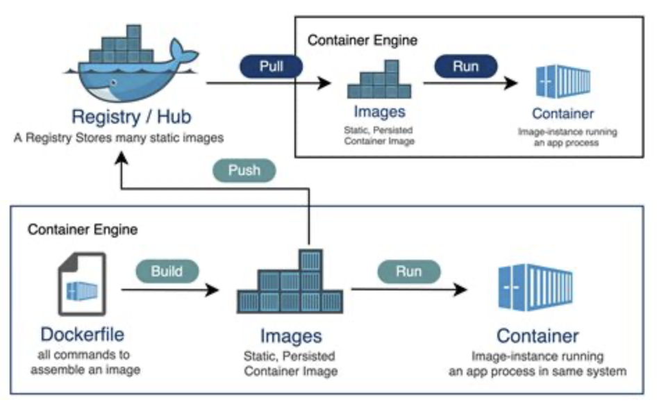

# README

## COMMANDS
Version: `docker --version`  
View working demo: `docker run hello-world`  
Fetch a busy box image (docker image registry to local): `docker pull busybox` 
View local images: `docker images` 
Load container (docker client finds images and run): `docker run busybox`  
Run command in docker: `docker run busybox echo "Hello from busybox"`  
List dockers running: `docker ps`  
List dockers running or not: `docker ps -a`  
Run multiple commands in docker (-it interactive mode, type exit if needed): `docker run -it busybox sh`  
See documentation: `docker run --help`
Remove container (you require the id): `docker rm ${id}`

## WORKING WITH DOCKER
*Develop the Application*:
- Start by developing your application using your preferred programming language and frameworks.
*Containerize the Application*:
- Create a Dockerfile that specifies the steps to build your application's Docker image.
- Use the Docker CLI to build the image: `docker build -t my-app .`
*Run Containers*:
- Use the Docker CLI to run containers from the created image:`docker run -d my-app`
- Multiple containers can run concurrently, each encapsulating a specific instance of your application.
*Manage Containers*:
Use Docker CLI commands to manage containers:
- `docker ps`: List running containers.
- `docker stop <container_ id>`: Stop a running container.
- `docker start <container id>`: Start a stopped container.
- `docker rm <container id>`: Remove a container.

## DOCKER REGISTRY
- Docker images are stored in a centralized repository called the Docker Registry
- The Docker Registry serves as a distribution hub for sharing and accessing Docker images  



## HANDS ON
Run a image (-d run in background or detach, -P expose all ports, --name assigns a name):  
`docker run -d -P --name catgif manifoldailearning/catgif`  
When running `docker ps` you'll see in catgif the command "python ./app.py", it runs a script  
View the port where catgif is running: `docker port catgif`
View the app running (on your browser): `localhost:<portviewed>`  
Stop container: `docker stop catgif`

## DOCKERFILE
It's a text file which contains a list of commands that docker should call 
whenever it is creating an image. You start by specifying the base image, 
with the command FROM. 
```dockerfile
FROM python:3.8
# Set a directory for the app
WORKDIR /usr/src/app
# Copy all the files to the container
COPY . .
# Install dependencies
RUN pip install -no-cache-dir -r requirements.txt
# Tell the port number the container should expose
EXPOSE 5000
# Run the command
CMD ["python","./app.py"] 
```
Now you can build your own image with the dockerfile. 
Create image: `docker build -t catgif2 .` . 
Run on your selected port (8888 is local): `docker run -p 8888:5000 catgif2`